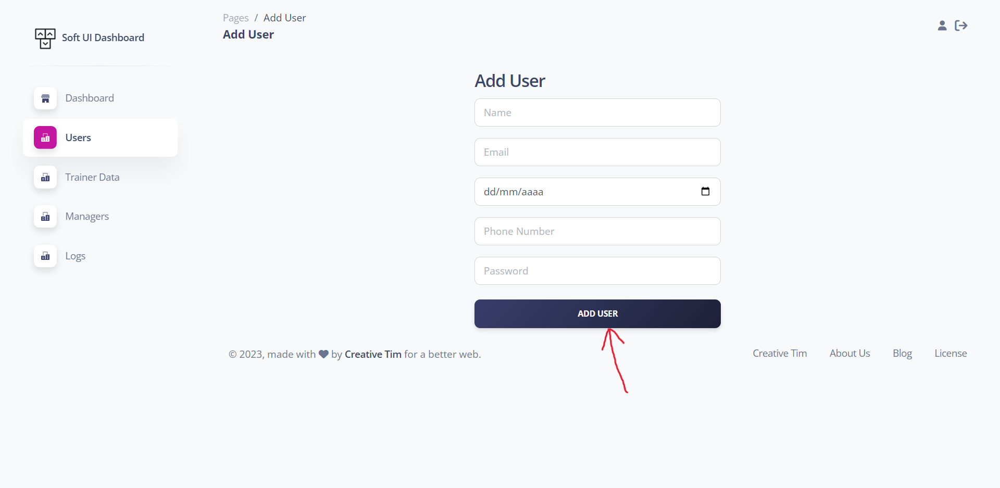
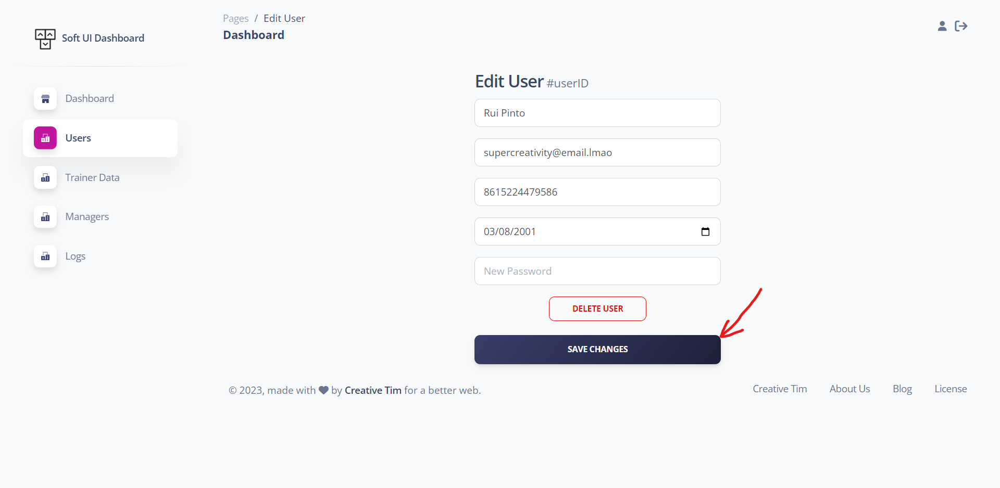
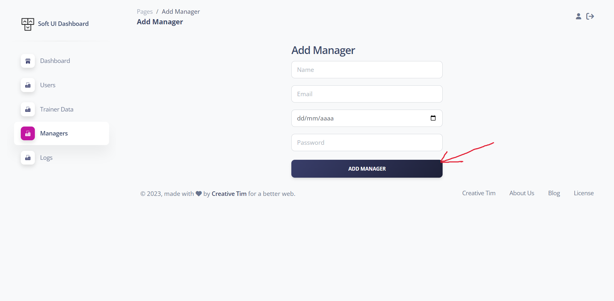
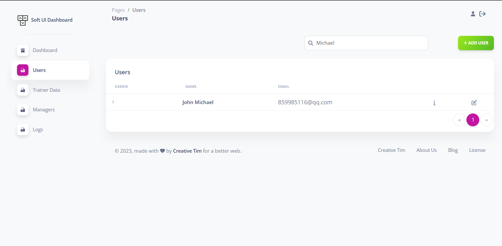

## Documentation
  - In this file we will document the methods for the Web Application, this methods are in our Class Diagram in Journal/Week4.
  - The gets , sets and constructor of classes need to be implemented too.
    
**Page: sign-in.html**

Function Name: Login

Function Type: OnClick() Button: SignIn
   * @param {string} Email
   * @param {string} Password
   * @return {Bool} 

Correct Operation: User will be logged, change IsLoged to true, and send the user to the Main Page  
Wrong Operation: Send message to user, this will happen if the State of the user is 0 or there is no User with that parameters  
Description: This method will be used to Log in the manager in the Web application. Sends to the database via APIRest. If the parameters are correct, the function returns True and change the value of the user IsLoged variable, otherwise, it returns False.  

    
**Pages: dashboard.html, profile.html, users.html**

Function Name: Logout

Function Type: OnClick() Button: Logout 
   * @param {int} Id 
   * @return {bool} 
  
Correct Operation: User will be logged out, change IsLoged to false, and send the user to the Login Page 
Wrong Operation: Send message to user. 
Description: This method will be used to Log the User out. Sends the id via APIRest to indicate that the user has logged out.  We will change the IsLoged variable to False and the user will be redirect to the Main Page without being Logged.  

 
 
  * Manager Class : Parameters
  class Manager {
  **/
   * Constructor for the Manager class, initializes the manager object with the given attributes.
   * @param {int} Id - The manager's unique identifier.
   * @param {string} Name - The manager's full name.
   * @param {string} Email - The manager's email address.
   * @param {string} Password - The manager's password.
   * @param {boolean} isLoged - Indicates if the manager is logged in or not.
   * @param {Date} BirthDate - The manager's birth date.
   * @param {boolean} State - The manager's state (active, inactive).
   * @param {boolean} Permissions - Admin/Manager(health related person)
   **/
  
    
  **Page:Page: addUser.html**
Function Name: add_User 

Funtion Type: OnClick() Button: Add User 
   * @param {int} Id 
   * @param {string} Name 
   * @param {string} Email 
   * @param {string} Password 
   * @param {date} Birthdate 
   * @return {bool} 
  
Correct Operation: Send message that the add occurred successfully.  
Wrong Operation: Send message to user that a error occurred. 
Description: Creates a user in the database. The Manager needs to have Admin permissions. 

**Page: editUser.html**
Function Name: edit_User 

Funtion Type: OnClick() Button: Edit User 
   * @param {int} Id 
   * @param {string} Name 
   * @param {string} Email  
   * @param {string} Password 
   * @param {date} Birthdate 
   * @return {bool} 

Correct Operation: Send message that the edit occurred successfully.  
Wrong Operation: Send message to user that a error occurred.  
Description: Updates a user information in the database. The Manager needs to have Admin permissions.  

   **Page: addManager.html**  
Function Name: add_Manager 

Funtion Type: OnClick() Button: Add User 
   * @param {int} Id 
   * @param {string} Name 
   * @param {string} Email 
   * @param {string} Password 
   * @param {date} Birthdate 
   * @return {bool} 

Correct Operation: Send message Add occurred successfully.  
Wrong Operation: Send message to user that a error occurred. 
Description: Creates a Manager in the database this can be a health related person or a admin. The Manager that creates other Manager needs to have Admin permissions.  

  
  * Logs Class : Parameters
 
  class Logs {
  **/
   * Constructor for the Logs class, initializes the manager object with the given attributes.
   * @param {Date} Timestamp
   * @param {string} description
   * @param {User} user
   * @param {string} type
   * @param {string} Past_data
   * @param {string} New_data
  **/
   
  **Page: Every Page**
Function Name: write_Logs 
Funtion Type: It will be called in every event, for example if we create a new user this method will be called after that. 
   * @param {Logs} log  
   * @return {bool}  

Correct Operation: Write In the database the action performed in the web app. 
Wrong Operation if the database is down: Send message that an error occurred. 
Description: Creates the log in the database, of every action that occurs in the web app 

  
  
**Page: Every Page** 
Function Name: see_Logs 

Funtion Type: OnLoad() function 
   * @param {Logs} log  
   * @return {bool} 

Correct Operation: Will show the list of Logs that occurred. 
Wrong Operation: Send message that an error occurred. 
Description: Shows the list of logs that occurred recently ,we will have pages, each page will show a list of 10 logs.

   
   
  * Charts Class: Parameters
  **/
  Constructor for the Charts class, initializes the chart object with the given attributes.
   * @param {boolean} isFavorite - Indicates if the chart is marked as a favorite.
   * @param {string} Name - The chart's name.
   * @param {string} Type - The chart's type (e.g., bar, line, pie, etc.).
   * @param {string} Description - A brief description of the chart.
   * @param {string} Motiom - The chart's motion settings (e.g., animation, transition, etc.).
  **/
  
  
**Page: : users.html, logs.html, manager.html** 
Function Name Filter_By_Name  

Funtion Type: OnChange() function  (Search bar) 
   * @param {string} name 

Correct Operation: Will show the charts with that name.  
Wrong Operation or no name found: Show message that no charts were found.  
Description: The Filter_By_Name function shows the Manager the chart with the name he wrote.  

  
**Page: : logs.html**
Function Name Filter_By_Type  

Funtion Type: OnChange() function  (Search bar) 
   * @param {string} type 
Correct Operation: Will show the charts with that type.  
Wrong Operation or no type found: Show message that no charts were found.  
Description: The Filter_By_Type function shows the Manager the chart with the name he wrote.  

      
**Page: users.html**
Function Name Get_Data  
Funtion Type: OnLoad() function   
Correct Operation: Get Data of Motion Class from the API.  
Wrong Operation or no data found: Show  error message.  
Description: The Get_Data function gets the data via Api  

**Page: Every Page**
Function Name Post_Data  
Funtion Type: OnLoad() function   
Correct Operation: Post Data for the API.  
Wrong Operation or no data found: Show  error message.  
Description: The Post_Data function sends the data via Api  
  

  MotionFrame : Only attributes
  /**
  * @param {float} x - real number.
  * @param {float} y - real number.
  * @param {float} z - real number.
  * @param {float} accX - real number.
  * @param {float} accY - real number.
  * @param {float} accZ - real number.
  * @param {float} asX - real number.
  * @param {float} asY - real number.
  * @param {float} asZ - real number.
  * @param {TimeStamp} time - Time when they get the data.
  
  **/
  
  MotionRecords : Only attributes
  /**
  * @param {int} MotionTag - An integer, not less than zero and not greater than six.
  * @param {Long} timeStamp - An integer, milliseconds from 1970-01-01 00:00
  * @param {TimeStamp} InitailTimeStamp - A TimeStamp, to mark the begining time of a motion record.
  * @param {MotionFrame} motionFrame - {X+Y+Z+asX+asY+asZ+accX+accY+accZ}9+Timestamp
  **/
  
  Motion Class : Only attributes
/**
   * @param {int} id - Indicates if the chart is marked as a favorite.
   * @param {MotionRecords[]}  - an array of MotionRecords objects that represents the motion records associated with the sensors
  **/
